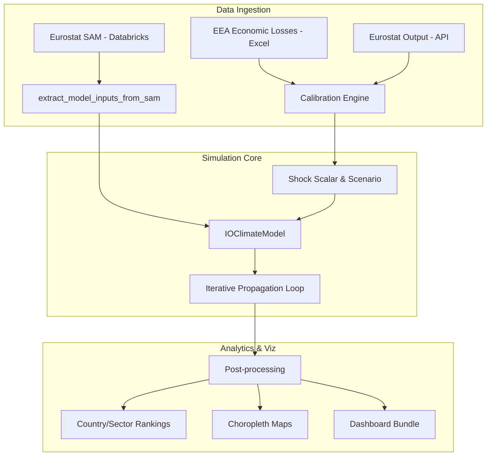

# Physical Climate Risk Propagation Model


## 🎯 Overview

This repository provides a high-performance simulation engine to quantify the **propagation of physical climate shocks** through complex production networks. 

While traditional climate risk models focus on property damage, this model focuses on **Business Continuity Risk**—measuring how a bottleneck in one country or sector (e.g., energy in Germany) cascades into productivity losses across the entire European value chain.

---

## 📖 Documentation

- **[Technical Whitepaper](docs/WHITEPAPER.md)**: Full theoretical methodology, mathematical formulation, and calibration logic.
- **[Data Dictionary](docs/DATA.md)**: Details on the Eurostat SAM schema and account conventions.
---

## 🔗 Model Architecture & Dependencies



---

## 🛠️ Key Features

- **Adaptive IO Mechanism**: Beyond static Leontief models, we implement non-linear rationing and bottleneck detection.
- **Historical Calibration**: Shocks are calibrated using 40+ years of EEA economic loss data, mapped to hazard-specific intensity percentiles.
- **Inventory Dynamics**: Models the role of stockpiles in mitigating short-term supply chain disruptions.
- **Global Reallocation ($\gamma$)**: Simulates market-based substitution within global sectors to absorb localized shocks.

---

## 🏗️ Repository Structure

```bash
src/
 ├─ data_io/       # Eurostat API & SAM ingestion
 ├─ io_climate/    # Core Simulation & Logic
 │   ├─ model.py        # Orchestration
 │   ├─ propagation.py  # Rationing & Reallocation math
 │   ├─ calibration.py  # EEA Loss -> Shock Mapping
 │   └─ viz.py          # Post-processing & analytics
```

---

## 🚀 Quick Start

Refer to `main_refactored_final_with_calibration.ipynb` for the complete end-to-end pipeline:

1. **Environment Setup**: Load the `src` package and locate input assets.
2. **Load SAM**: Extract the technical coefficients ($A$) and flow matrices ($Z$).
3. **Calibrate**: Process EEA losses and Eurostat output to build the Intensity Panel.
4. **Choose Scenario**: Select a (Country, Hazard, Intensity) triplet (e.g., "Severe Flood in Germany").
5. **Simulate**: Execute the `IOClimateModel` propagation loop.
6. **Visualize**: Generate dashboard-ready impact tables and maps.

---

## ⚖️ Disclaimer
This model is a **risk indicator** intended for stress-testing and macroeconomic research. It assumes fixed production technologies and historical-based vulnerabilities.
