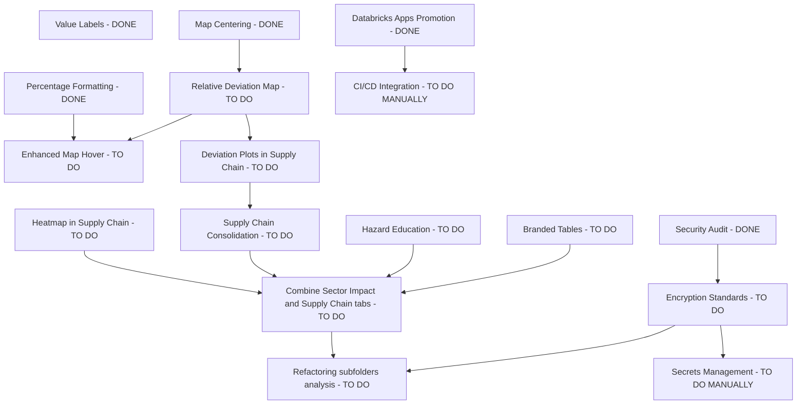

# ADR-001: Technical Direction for Streamlit Physical Climate Risk Application

## Status
Accepted

## Context
The roadmap focuses on two horizons:
- Near-term analytics and UX refinements in a Streamlit dashboard (visual consistency, deviation-based analytics, tab restructuring, and interpretability aids).
- Mid/long-term operational hardening (encryption controls and repository refactoring), with CI/CD and secrets migration already recognized as manual process tasks.

Given the existing monorepo Python codebase and Databricks Apps deployment direction, the architecture should evolve without unnecessary platform fragmentation.

## Decision

### Recommended Design Patterns
1. **Modular Monolith (primary pattern)**
   - Keep a single deployable Streamlit app while enforcing strict internal module boundaries (`data_io`, `io_climate`, `app/ui`, `app/services`).
   - Best fit because roadmap items are mostly UI/analytics cohesion improvements, not independent domain services.

2. **Hexagonal Architecture (inside the monolith)**
   - Domain core (calibration, propagation, analytics transforms) isolated from framework adapters (Streamlit components, Databricks connectors, file/cache adapters).
   - Enables easier testing and supports future migration (e.g., batch API service) without rewriting business logic.

3. **Pipeline/Transformation Pattern for analytics views**
   - Standardize transformation stages: raw model output -> normalized metrics -> derived deviations -> presentation models.
   - Ensures map, tooltip, bar, and heatmap consume consistent metric definitions.

4. **Configuration + Policy Injection for security controls**
   - Centralized configuration provider for encryption and storage policy checks.
   - Avoids scattering security-critical logic across UI and data modules.

### Why Not Microservices / Full Event-Driven Now
- The roadmap does not require independently scalable bounded contexts or asynchronous cross-service workflows.
- Operational overhead (service orchestration, observability, inter-service auth) would exceed near-term value.
- A well-structured modular monolith keeps delivery speed high while retaining a migration path later.

## Proposed Solution
1. **Create a unified analytics contract**
   - Introduce shared metric functions for `loss_pct`, `loss_pct_deviation`, ranking metadata, and formatting.
   - All visual components consume this contract to eliminate semantic drift.

2. **Refactor UI composition into feature modules**
   - `ui/features/maps`, `ui/features/sector_analysis`, `ui/features/tables`, `ui/features/education`.
   - Merge Sector Impact + Supply Chain into a single composed workspace with synchronized controls.

3. **Design token and styling abstraction**
   - Centralize retrieval of design tokens and table/chart style helpers.
   - Prevent hard-coded visual styles and ensure brand consistency.

4. **Security hardening lane**
   - Implement environment-aware storage and encryption policy validators.
   - Add release checklist gates for encryption compliance.

5. **Repository structure hardening lane**
   - Run folder-structure audit and execute staged refactor plan with compatibility adapters where needed.

## Roadmap Dependency DAG

## Parallelization Guidance
- **Can run in parallel now**:
  - Branded Tables (`A4`), Hazard Education (`C1`), and Encryption (`E2`) are largely independent.
  - Heatmap work (`B4`) can proceed independently of deviation-map implementation until integration in combined tab.
- **Hard dependencies**:
  - Relative Deviation Map (`B1`) should precede Enhanced Hover (`B2`) and Deviation Plots (`B3`) because they reuse its metric contract.
  - Supply Chain Consolidation (`B5`) and Heatmap (`B4`) should be completed before final tab merge (`B6`).
  - Encryption controls (`E2`) should precede secrets finalization (`E3`) and inform refactoring decisions (`F1`).

## Consequences
- Faster delivery for roadmap items with lower architectural risk.
- Improved semantic consistency across visualizations.
- Stronger compliance posture for enterprise deployment.
- Maintains an evolution path toward service decomposition if product scope expands.
